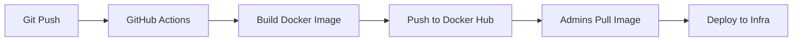

# 🌤️ Projet DevOps - Application Météo

[](https://github.com/tom-dab/docker-project/actions/workflows/docker-build.yml)

## 📋 Description

Application météo conteneurisée avec pipeline CI/CD automatisé.

## 🏗️ Architecture

- **Application** : Node.js (frontend météo)
- **API** : Open-Meteo
- **CI/CD** : GitHub Actions
- **Registry** : Docker Hub

## 🚀 Workflow DevOps

### Pour les développeurs
```bash
# 1. Développer localement
npm install
node server.js

# 2. Commiter les changements
git add .
git commit -m "feat: ajout nouvelle fonctionnalité"
git push origin main

# ✨ GitHub Actions build automatiquement l'image Docker
```

### Pour les admins réseau
```bash
# Récupérer la dernière version
docker pull votre-username/meteo-app:latest

# Ou une version spécifique
docker pull votre-username/meteo-app:v2

# Lancer l'application
docker run -p 3000:3000 votre-username/meteo-app:latest
```

## 📦 Système de versioning automatique

Le pipeline CI/CD crée automatiquement plusieurs tags :

| Événement | Tags créés | Exemple |
|-----------|-----------|---------|
| Push sur `main` | `latest`, `main`, `main-<sha>` | `latest`, `main-a1b2c3d` |
| Push sur `develop` | `develop`, `develop-<sha>` | `develop-x7y8z9` |
| Tag git `v1.2.3` | `v1.2.3`, `v1.2`, `v1` | `v1.2.3` |

### Comment créer une release versionnée
```bash
# Créer un tag git
git tag v3.0.0
git push origin v3.0.0

# GitHub Actions crée automatiquement :
# - votre-username/meteo-app:v3.0.0
# - votre-username/meteo-app:v3.0
# - votre-username/meteo-app:v3
```

## 🔄 Pipeline CI/CD


## 📊 Versions disponibles

- `beta` : Version initiale
- `v1` : Fonctionnalités de base
- `v2` : Prévisions 7 jours
- `v3+` : Versions automatiques via CI/CD

## 🛠️ Technologies

- Node.js 18
- Docker
- GitHub Actions
- Docker Hub
- Open-Meteo API

## 👥 Équipe

- **Dev** : Développement et CI
- **Ops** : Infrastructure et déploiement